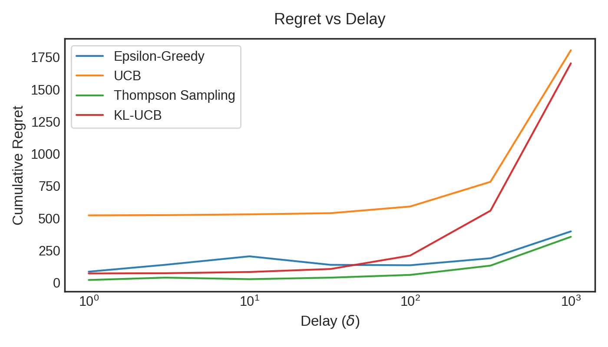
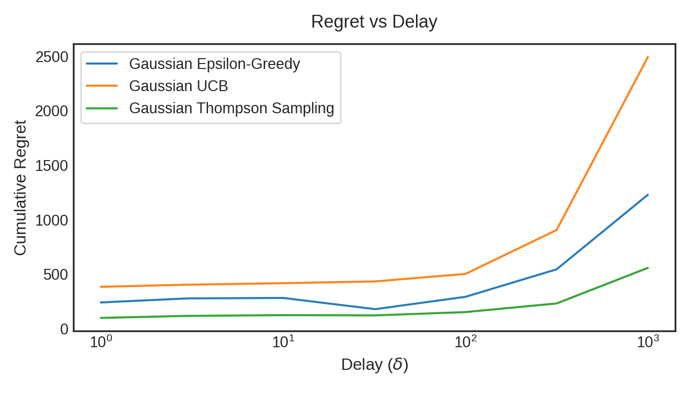

# Delayed Feedback Experiments

## Bernoulli Bandit



```latex
\begin{table}[h!]
\centering
\begin{tabular}{lccccccc}
\toprule
$\delta$ & 1 & 3 & 10 & 32 & 100 & 316 & 1000 \ \midrule
Epsilon-Greedy & 84 & 138 & 203 & 137 & 134 & 188 & 397 \
UCB & 521 & 523 & 529 & 539 & 590 & 782 & 1,804 \
Thompson Sampling & 20 & 38 & 26 & 38 & 59 & 131 & 355 \
KL-UCB & 70 & 72 & 82 & 105 & 209 & 558 & 1,702 \
\bottomrule
\end{tabular}
\caption{Influence of the delay: regret when the feedback is provided every $\delta$ steps.}
\end{table}
```

## Gaussian Bandit



```latex
\begin{table}[h!]
\centering
\begin{tabular}{lccccccc}
\toprule
$\delta$ & 1 & 3 & 10 & 32 & 100 & 316 & 1000 \ \midrule
Gaussian Epsilon-Greedy & 241 & 278 & 283 & 180 & 293 & 545 & 1,229 \
Gaussian UCB & 385 & 404 & 418 & 434 & 503 & 906 & 2,492 \
Gaussian Thompson Sampling & 100 & 118 & 125 & 123 & 153 & 232 & 559 \
\bottomrule
\end{tabular}
\caption{Influence of the delay: regret when the feedback is provided every $\delta$ steps.}
\end{table}
```
